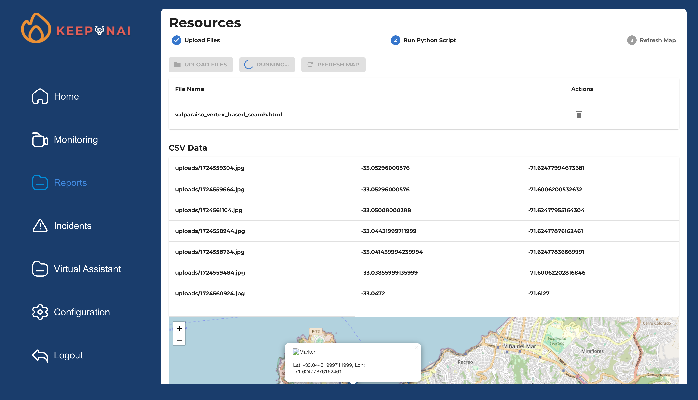
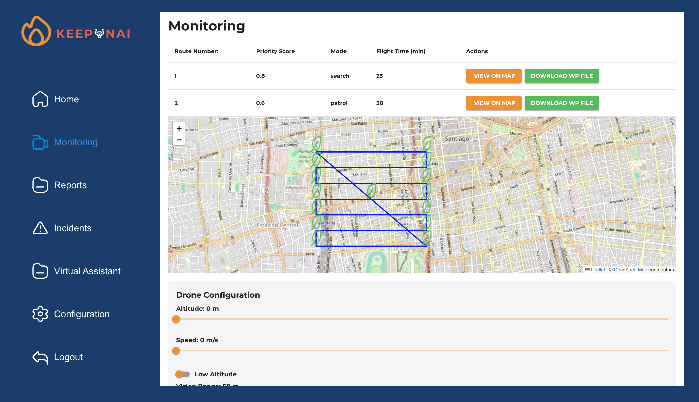
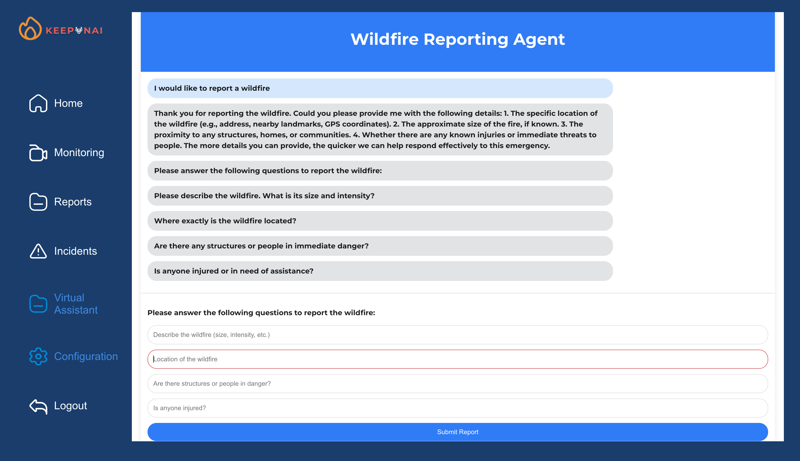

# Fire Eye Dashboard

**Fire Eye Dashboard** is a web application designed for the management and monitoring of emergencies, specifically fires, by emergency personnel and local users. The application allows visualization of incidents, available resources, weather conditions, and more, all in an intuitive and easy-to-use interface.

## Table of Contents

- [Features](#features)
- [Technologies Used](#technologies-used)
- [Project Structure](#project-structure)
- [Installation](#installation)
- [Usage](#usage)
- [Contributing](#contributing)
- [License](#license)

## Features

- **Interactive map:** Visualization of fires, affected areas, and deployed resources.
- **Drone monitoring:** Activate the algorithm to find the route the drone will take.
- **Data loading:** Upload information collected by the drone to determine if there are fires.
- **Reports:** Generation of detailed reports for post-incident analysis. (Planned for the future)
- **Custom configuration:** Personalized settings for emergency and local users. (Planned for the future)

## Technologies Used

- **Frontend:**
  - [Next.js](https://nextjs.org/)
  - [React.js](https://reactjs.org/)
  - [Styled-Components](https://styled-components.com/)
  - [React Router](https://reactrouter.com/)
  - [Google Fonts](https://fonts.google.com/)

- **Backend:**
  - [Flask](https://flask.palletsprojects.com/)

- **Others:**
  - [Node.js](https://nodejs.org/)
  - [Git](https://git-scm.com/)
  - [GitHub](https://github.com/)

## Project Structure

The project is divided into two main sections:

- **Frontend:** In the `frontend` directory, you'll find the Next.js application that includes all the user interface components.
- **Backend (Future):** In the `backend` directory, there are plans to include the Flask API for data management and server logic.

## Installation

Follow these steps to set up the project in your local environment:

1. **Clone the repository:**

   ```bash
   git clone https://github.com/AzulRK22/fire-eye-dashboard.git
   cd fire-eye-dashboard
   ```

2. **Set up the frontend:**

   ```bash
   cd frontend
   npm install
   ```

3. **Set up the backend:**

   ```bash
   cd ../backend
   python -m venv venv
   source venv/bin/activate
   pip install -r requirements.txt
   flask db upgrade
   ```

4. **Start the frontend:**

   ```bash
   cd ../frontend
   npm run dev
   ```

5. **Start the backend:**

   ```bash
   flask run
   flask --app app.py --debug run
   ```

6. **Access the application:**

   Open your browser and go to http://localhost:3000 to see the application running.

## Usage

Main Screen: From here, users can choose to identify themselves as emergency personnel or local users to access the corresponding dashboard.
Emergency Personnel Dashboard: Visualize incidents, available resources, monitor in real-time, and generate reports.
Local User Dashboard: Access reports and customized settings for local users.

## Contributing

If you wish to contribute to the project, follow these steps:

1. Fork the repository.
2. Create a new branch (`git checkout -b feature/new-functionality`).
3. Make your changes and commit (`git commit -am 'Add new functionality'`).
4. Push your branch (`git push origin feature/new-functionality`).
5. Open a Pull Request.

## Screenshots

### Analysis


### Monitoring


### Virtual Assistant
